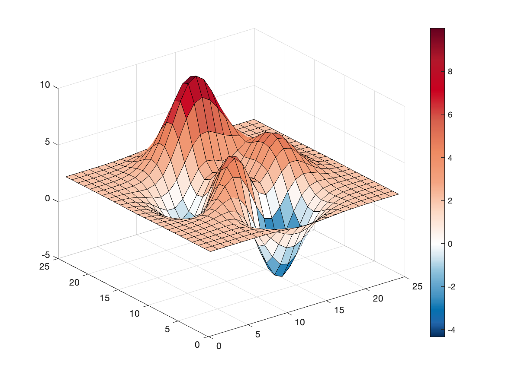
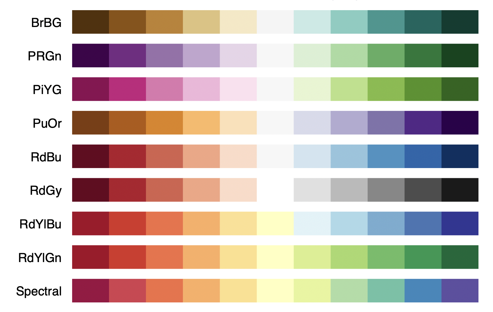
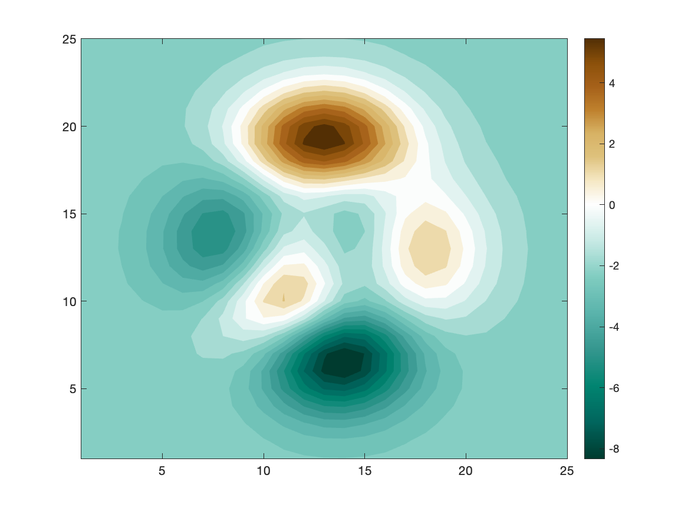

# Centered Colormap

by [Matteo Courthoud](https://matteocourthoud.github.io/)

function file: `centered.m`

example file: `example.m`

---

This package provides colormaps centered on the white color corresponding to zero. Just specify `centered`as an argument to a colormap to use the default centered colormap.

```
surf(peaks(25)+2);
colormap(centered), colorbar
```



Even if the scale is asymmetric (positive), the palette has the color white centered on zero.

The function takes different color palettes as arguments.



For example, we can use the `BrBg` palette.

```
contourf(peaks(25)-2,25,'linestyle','none'); 
colormap(centered('BrBg')), colorbar;
```



Again, even if the scale is asymmetric (negative), the palette has the color white centered on zero.